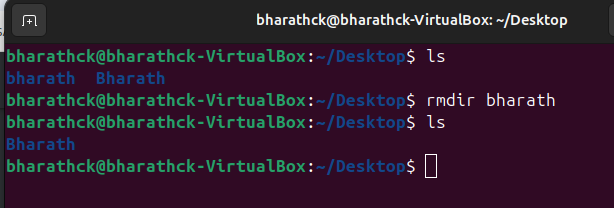

# Day - 1 Linux OS
## Linux Commands:  
* Basic commands for file management, navigation, and system information *  
### File and Directory Management  
#### cd (change directory) command: This command changes the current directory to the one specified by the absolute path.
1. Change to a specific directory: (cd path/to/directory)
       
2. Change to the home directory: (cd ~ or cd $HOME or cd )  
       
3. Move up one directory or parent directory: (cd .. or cd -)
       
#### ls (list all directories) command: The ls command in Linux is used to list the contents of a directory.
1. List files and directories in the current directory: (ls)
2. List files and directories in a specific directory: (ls path/to/directory)
       
3. List files and directories in a long format: (ls -l)
       
4. List files and directories including hidden files: (ls -a)
       
5. List files and directories including hidden files: (ls -R)
       

#### pwd (printing working directory) command: Shows the current directory path.
   
#### mkdir (make directory) command: This command creates a directory.
   
#### rmdir (remove directory) command: The rmdir command in Linux is used to remove directories (folders) that are empty.
   
#### mv (move) command: The mv command in Linux is used to move or rename files and directories. 
   1. Move a file to a different directory:
      
   2. Rename a file:
      
#### touch command: This command create a file like, text, doc,..ect)
   

#### Opening nano and gedit text editors
   
   
   

#### cat (concatenate) command: The cat command in Linux is used to concatenate and display the contents of files. 
 1. Display the contents of a file:
    
 2. Concatenate multiple files:
    
 3. Output to a new file:
     
 4. Append to an existing file: Anything you type will be appended to existingfile.txt. Press Ctrl + D to save and exit.
     
#### grep command: 
 1. Search for a pattern in a single file: This command searches for the given pattern within the given file and displays all lines that contain the pattern.
 2. Display line numbers: The -n option adds line numbers to the output, indicating the line number of each matched line.
 3. Case-insensitive search: The -i option performs a case-insensitive search, ignoring the distinction between uppercase and lowercase letters.
 4. Invert match (exclude a pattern):The -v option displays lines that do not match the specified pattern, effectively excluding those lines from the output
 5. Match the pattern against all files in a directory: The -r option searches the pattern against all the files in the specified directory
       
#### cp (copy) command: This command is used to copy files or group of files or directories. 
   

## File and Directory Compression Commands
 ### gzip command: This command is used to compress a file with gzip compression.
  
 ### gunzip command: Lets decompress the project_plan.pdf.gz file which we created in the last step.
  
  
## Environment Variable Commands  
 ### env command: This command displays all the environment variables.
   
 ### echo command: This command displays the environment variable.
   
 ### unset command: This command removes a variable.
   
    
## Network Configuration
 ### ifconfig command: This command is used to display information for all active network interfaces.
  
 ### ping command: The ping command in Linux is used to test network connectivity by sending ICMP echo request packets to a specific destination.
  
 ### ssh command: The ssh command is used in Linux to establish a secure shell (SSH) connection to a remote server or device. 
  

