# Day - 2 Linux OS
## linux command
### Users and Permissions
 #### 1. adduser command: This command is used to add a user.
   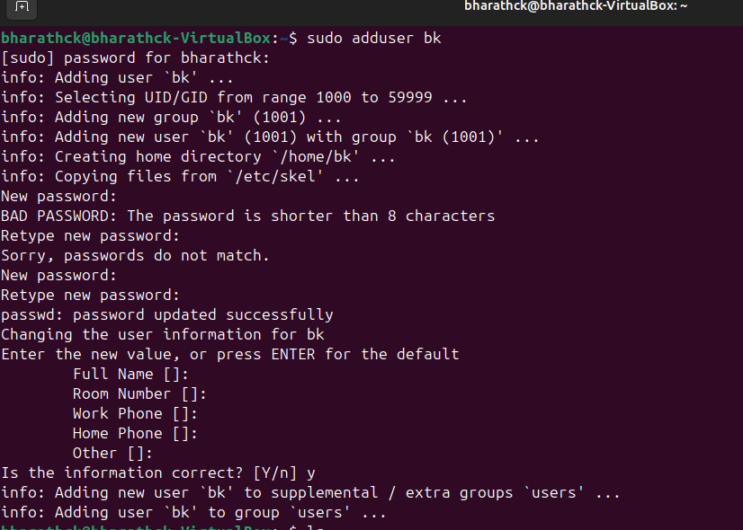
 #### 2. passwd command: This command is used to change the password of a user.
   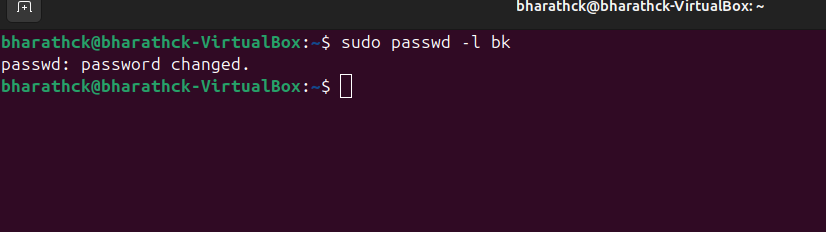
 #### 3. userdel command: This command is used to remove a newly created user.
   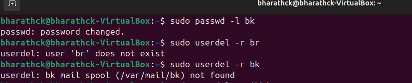
 #### 4. finger command: This command shows the information of all the users logged in.
   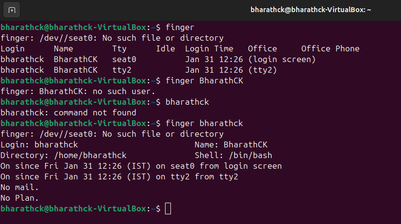
### File Permissions
 #### 1. ls -l (or with filename) command: This command is used to show the file permissions along with the owner and other details of the specified file. 
   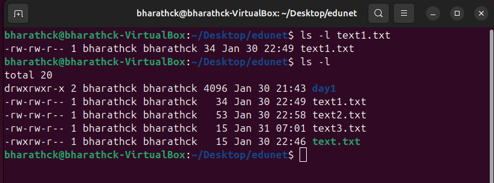
 #### 2. chmod command: The chmod command stands for “change-mode” which means that using this command, we can change the mode in which some user is able to access the file
   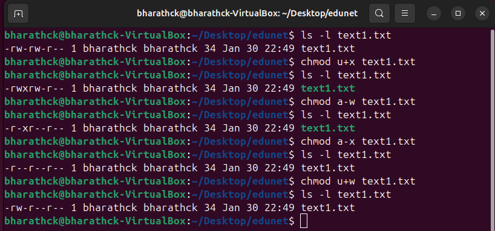
### System Information Commands
 #### history command: This command displays the list of all the typed commands in the current terminal session.
   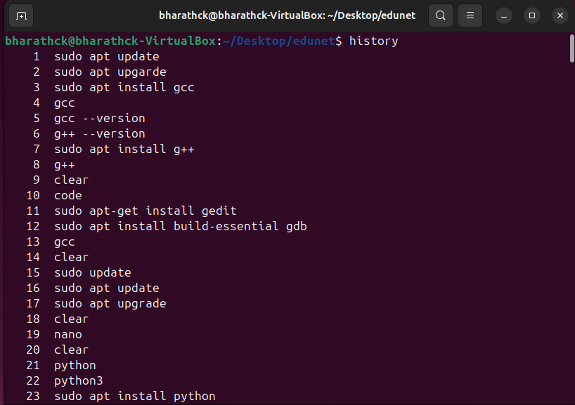
 #### clear command: Clears the terminal i.e. no previous command will be visible on the screen now.
   $ clear
 #### hostname command: Shows the name of the system host.
   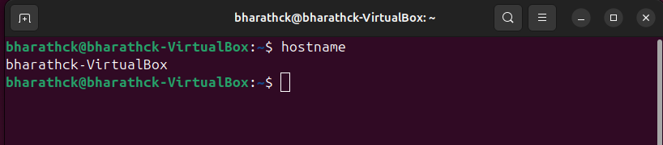
 #### hostid command: Shows the name of the system host.
   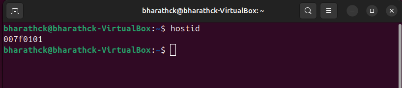
 #### sudo command: Allows a regular user to run the programs with the security privileges of a superuser or root.
 #### apt-get command: 
  Example   
   $ sudo apt-get update   
   $ sudo apt-get upgrade   
   $ sudo apt-get install package_name  
   $ sudo apt-get purge package_name  
   $ sudo apt-get remove package_name  
 #### date command: This command is used to show the current date and time. 
  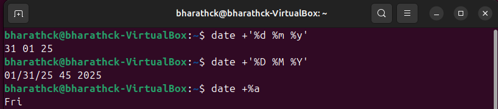
 #### cal command: Shows the calendar of the current month.
   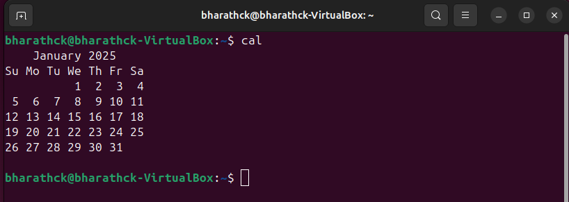
 #### whoami command: This command displays the name with which you are logged in.
   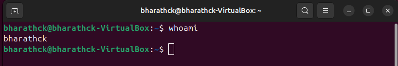
 #### whereis command: The "whereis" command in Linux is used to locate the binary, source code, and manual page files for a given command or program.
   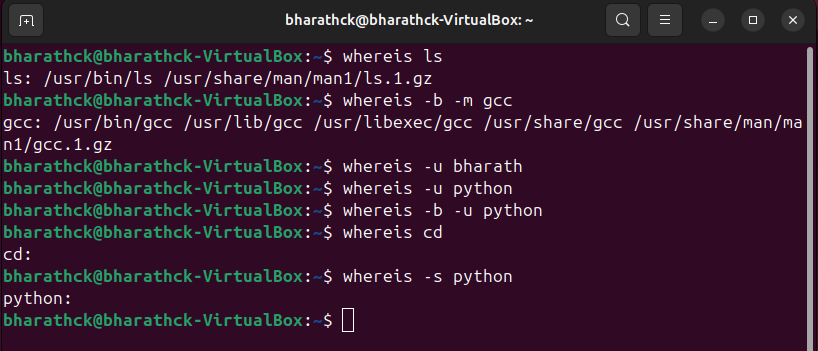
 #### top command: This command is used to get the details of all active processes.
   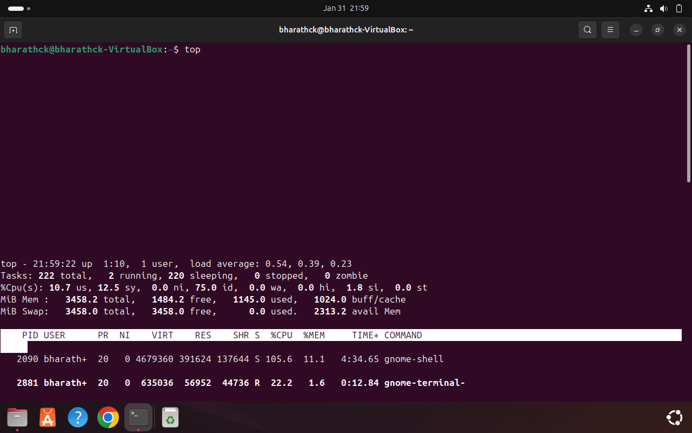
 #### ps command: The "ps" command in Linux is used to provide information about the currently running processes on the system.
   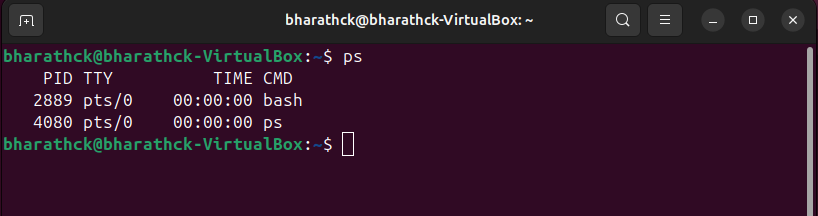
 #### ps PID command: This command gives the status of a particular process.
   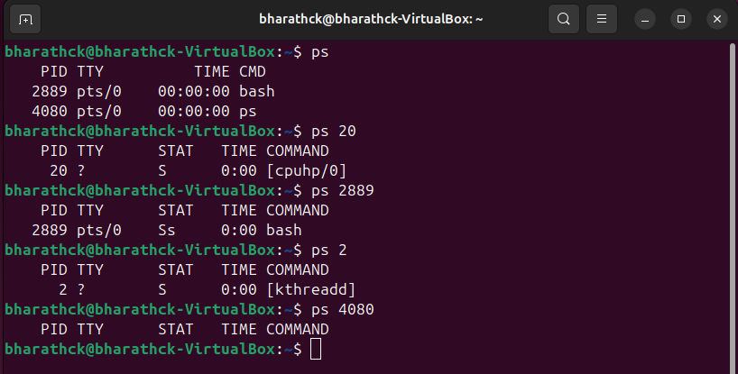
 #### pidof command: This command is used to give the process ID of a particular process.
   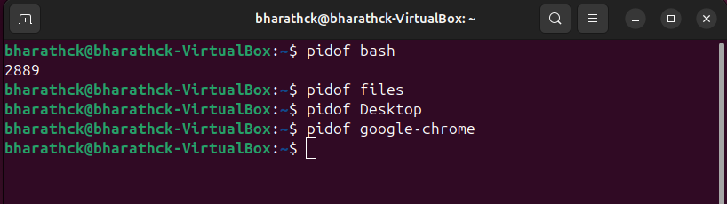

### Hardware Configuration Commands
  #### cpu-info command: This command is used to display the information about your CPU. It can be used after installation of the necessary package using sudo apt install cpuinfo.
   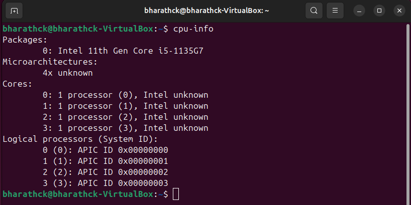
  #### free -h command: This command is used to display the free and used memory. The -h flag is used for converting the information (to be displayed) to human-readable form.
   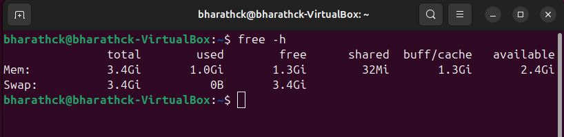
  #### lsusb -tv command: List all the USB connected devices.
   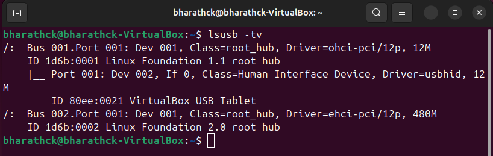
  #### cat /proc/meminfo command: Gives the information about memory like total and occupied and so on.
   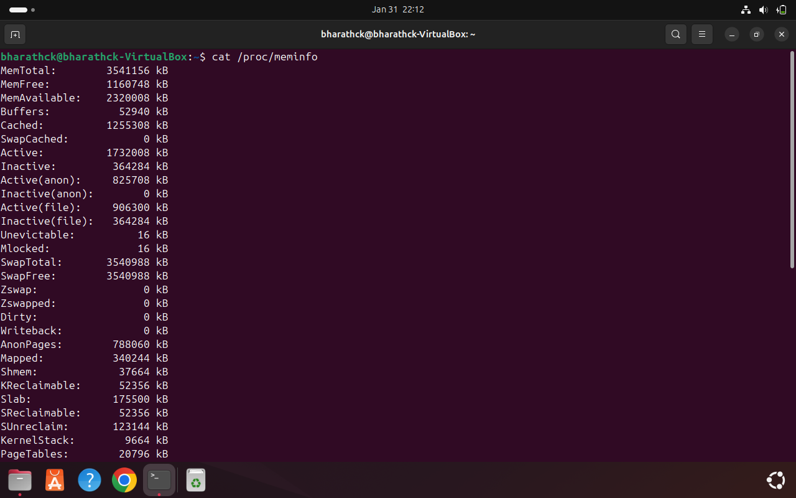
  #### du command: This command stands for disk usage and is used to estimate the space usage for a file or directory. 
   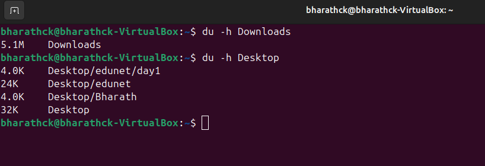

