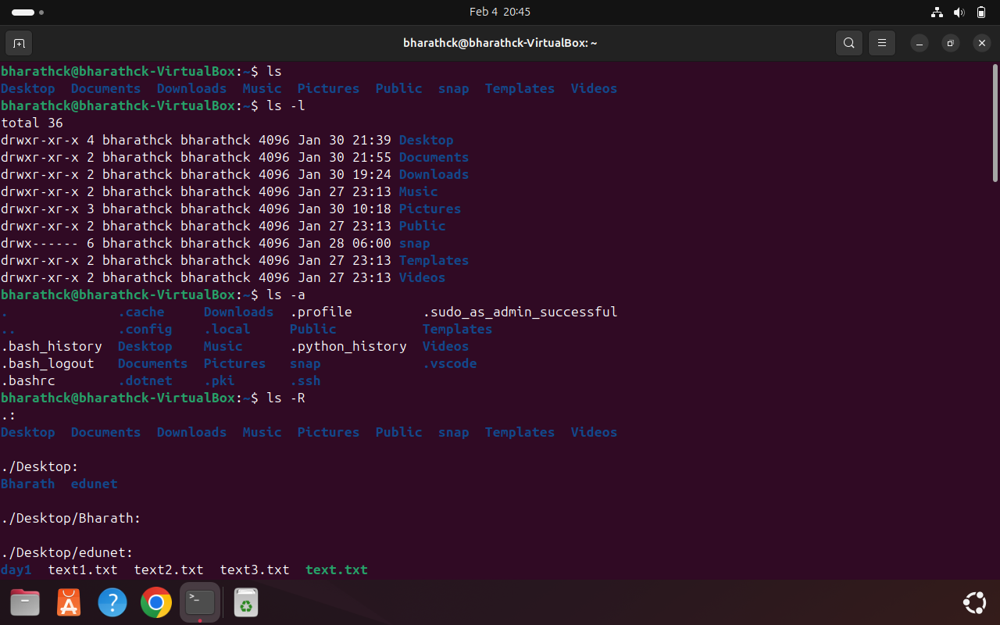
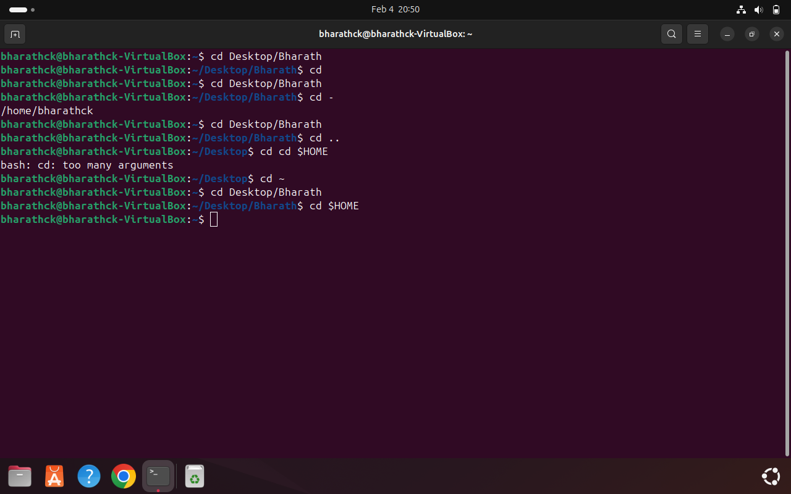
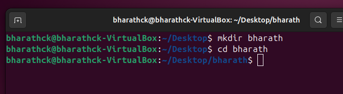
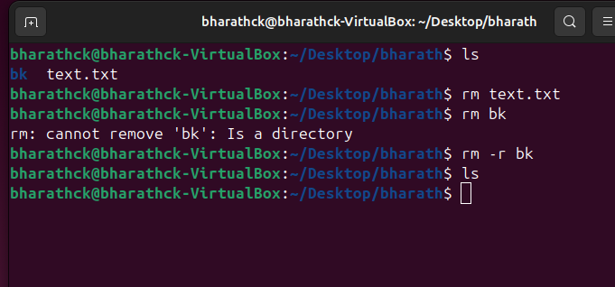
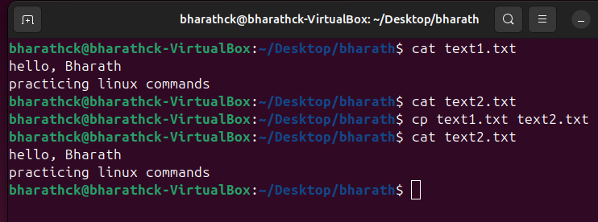
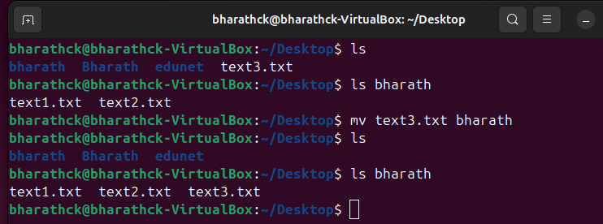
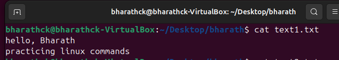
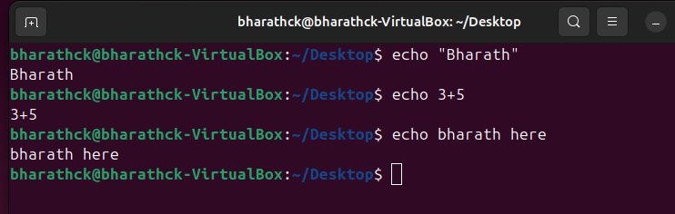
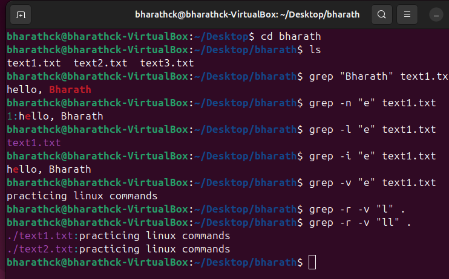
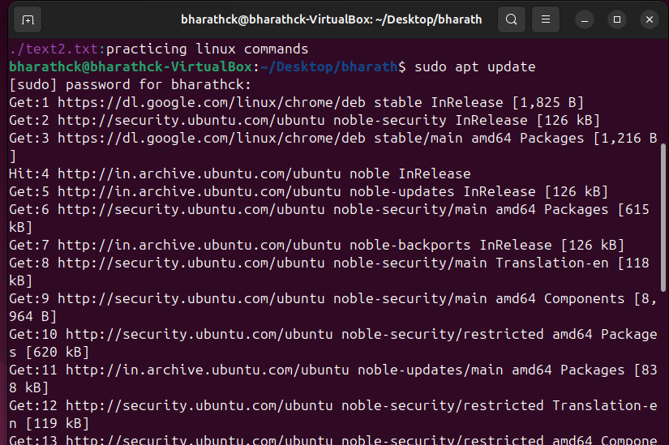

## Downloading and Installing Ubuntu 
## Question 1: What are some basic Linux commands?
1.	ls - lists the content of the current directory  
   
2.	cd - changes the current directory  
   
3.	mkdir - creates a new directory  
   
4.	rm - removes a file or directory  
   
5.	cp - copies a file or directory  
   
6.	mv - moves or renames a file or directory  
   
7.	cat - displays the content of a file  
   
8.	echo - prints a message to the terminal  
   
9.	grep - searches for a pattern in a file  
   
10. sudo - gives administrative privileges to a command  
   
