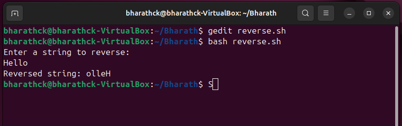
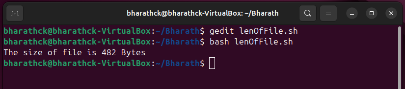
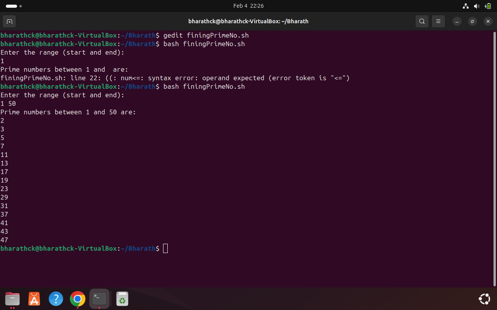

## 1. Write a shell script to reverse a string  
#### Program file [Reverse a String](./reverseOfString.sh)  
  
## 2. Write a shell script to find the length of file  
#### Program file [Lenget of file](./lenOfFile.sh)
  
## 3. Write a shell script to find prime numbers   
#### Program file [Reverse a String](./findingPrimeNo.sh)  
  
